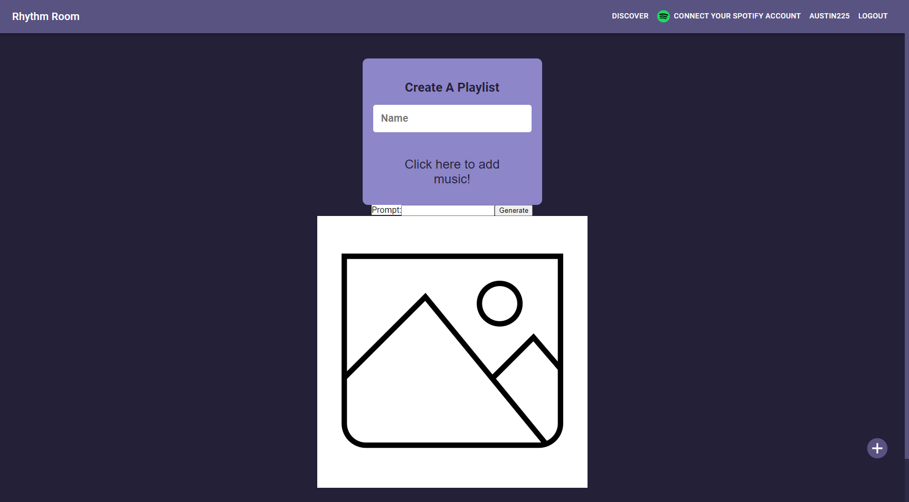

# Rhythm Room

## Links

Live Site: https://rhythm-room.herokuapp.com/

Repo: https://github.com/jason-lieb/Rhythm-Room

Austin: https://github.com/waustin45

Jason: https://github.com/jason-lieb

Joe: https://github.com/joemeetjoe

Lantao: https://github.com/pppzlt

Matt: https://github.com/codex-scribe

## Description

A site where any user can create an account and see a list of playlist. The user can like each plalist of they desire, but they could also create their own playlist to be liked by other users.

## User Story

```
As a user I want to be able to create an account.

Once I create an account I want to edit my profile.

When my profile is edited I want to create a playlist

When my playlist is created

Then I want to add songs

Once songs are added

I want to be able to view and like other user’s playlists
```

## HomePage


## Playlist


## Profile


## Create A playlist


