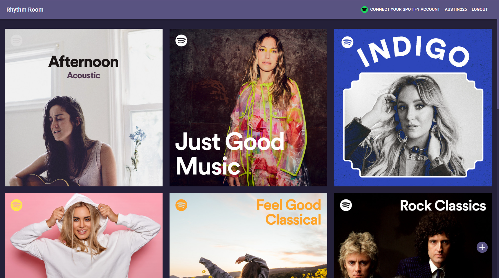
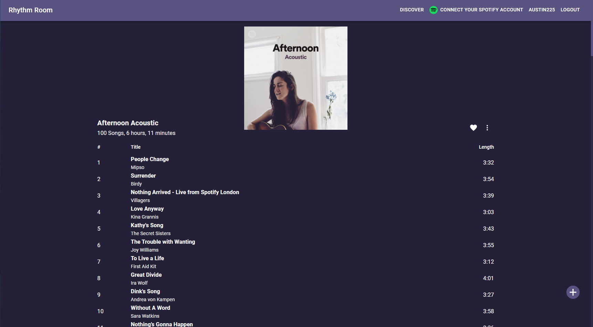
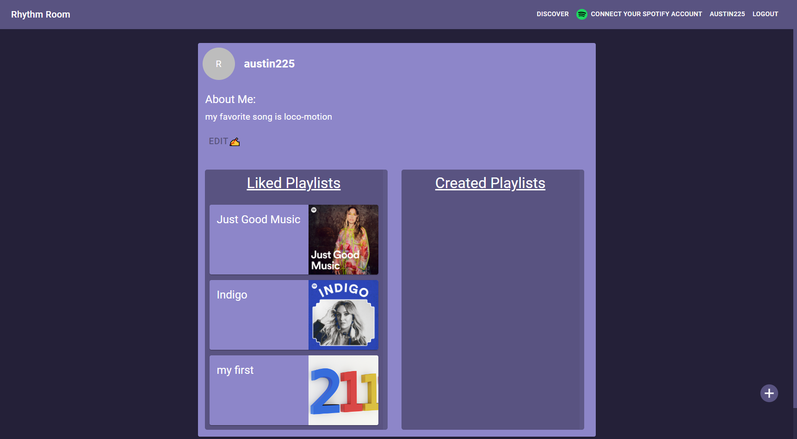
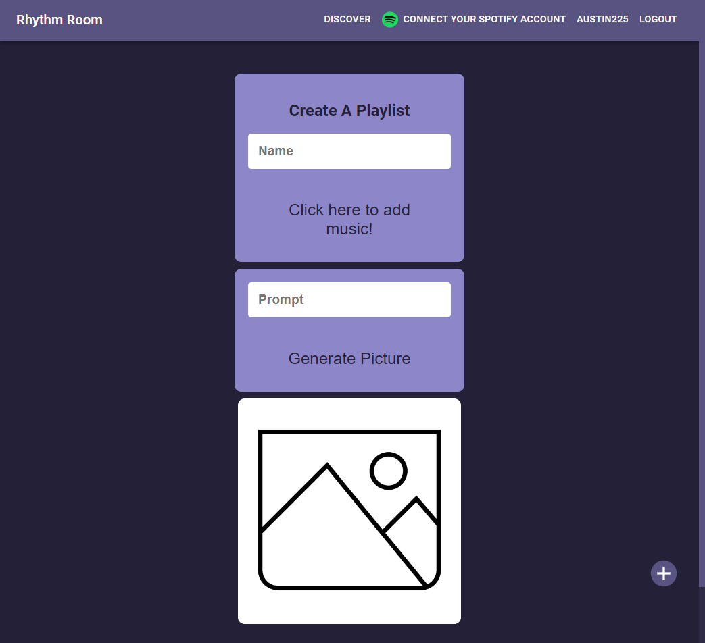

# Rhythm Room

## Description

A site where users can explore and share their favorite music. A user can create an account and then explore the library of playlists. When they like a playlist, it is added to their library for finding again easily. They can also create their own playlist from a library of songs, and leave comments on every playlist.

## Deployed Application

[Rhythm Room](https://rhythm-room.herokuapp.com/)

## Home Page

## Playlist

## Profile

## Create a Playlist

## Technologies

- React
- Material UI
- NodeJS
- Express
- GraphQL
- MongoDB
- Heroku
- Spotify API
- OpenAI API

## Contributors

- [Austin](https://github.com/waustin45)
- [Jason](https://github.com/jason-lieb)
- [Joe](https://github.com/joemeetjoe)
- [Lantao](https://github.com/pppzlt)
- [Matt](https://github.com/codex-scribe)
